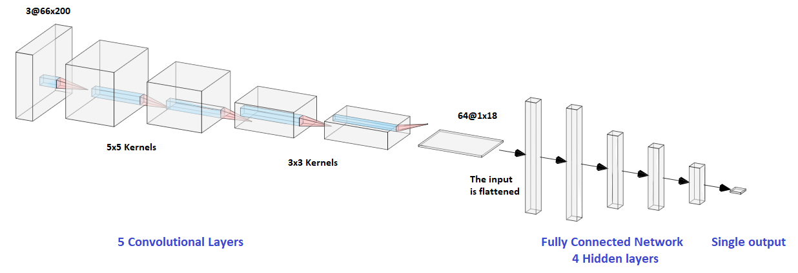

# Artificial Intelligence Laboratory
## Self Driving Car Simulation

@ ECAM 2019

This project consists of designing and developing an AI able to drive a car to keep it on the road in a simplified environment. 

The simulator is part of the *Udacity's Self-Driving Car Simulator* project available at the following address https://github.com/udacity/self-driving-car-sim

## Algorithm
We have implemented a **Convolutional Neural Network** (CNN) with Tensorflow in order to build our AI. The global network consist of 5 convolutional layers followed by 5 fully connected layers.
The given output is the angle of the steering wheel.

The speed of the car has been fixed to a particular value based on several tests.

The inputs are the RBG images captured by the simulator and resized to 60x200. Whe used nearly 5000 of them with an epoch=400 (so each input has been used 400 times to train the model). The network has been trained using batches of size=400

A type of *Gadient Descent* algorithm, the Adam Optimizer, has been used for the backpropagation method to update the weights (both for the kernels and the fully connected layers)

## Getting Started

### Dependencies

- Car simulator from Udacity
- Python libraries: Tensorflow, Numpy, Pillow, Socketio, Eventlet

### Installing

Just download the simulator and clone this repository. 

The CNN available on this repository has **already been trained** with images registered locally. The model is stored in the .ckpt files

* SDC_CNN.py : contains the class representing our CNN with methods to train it and to test it (aka predict the angle of the steering wheel)
* train.py : retrieves the images and the corresponding steering wheel values based on the CSV file generated by the simulator. Then creates the CNN and launch the training.
* drive.py : establishes the communication with the simulator running in autonomous mode. It gets the images and sends back the angle for the steering wheel.
* test.py : a simple test on a single image as input before launching the entire training

### Training

If you want to train the CNN yourself you'll need to generate input images. To do so, launch the *beta_simulator* 
application in normal mode and record yourself driving the car manually for a few laps.

Then change the path to your CSV file in *train.py* and run the script.

### Running
Launch the *beta_simulator* application in **autonomous mode** and select the left track.

Then run the *drive.py* file to start the simulation.

## Built With

* [Tensorflow](https://www.tensorflow.org/) - The core open source library used to build the CNN

## Authors

* **Lekens Amaury**
* **Wéry Benoît**

## References ##

* [End to End Learning for Self-Driving Cars](https://arxiv.org/pdf/1604.07316.pdf) - NVIDIA Corporation, 25/04/2016
* [MIT 6.S094: Convolutional Neural Networks for End-to-End Learning of the Driving Task](https://www.youtube.com/watch?v=U1toUkZw6VI&list=PLrAXtmErZgOeiKm4sgNOknGvNjby9efdf&index=11) - Lex Fridman, 25/01/2017
* [An Introduction to Convolutional Neural Networks](https://towardsdatascience.com/convolutional-neural-network-17fb77e76c05) - Arunava, 25/12/2018
* [Epoch vs Batch Size vs Iterations](https://towardsdatascience.com/epoch-vs-iterations-vs-batch-size-4dfb9c7ce9c9) - Sagar Sharma, 22/09/2017
* [How convolutional neural networks work, in depth](https://www.youtube.com/watch?v=JB8T_zN7ZC0) - Brandon Rohrer, 17/08/2018
* [Gentle Introduction to the Adam Optimization Algorithm for Deep Learning](https://machinelearningmastery.com/adam-optimization-algorithm-for-deep-learning/) - Jason Brownlee, 03/07/2017
## Acknowledgments

* CBF, HIL, LUR